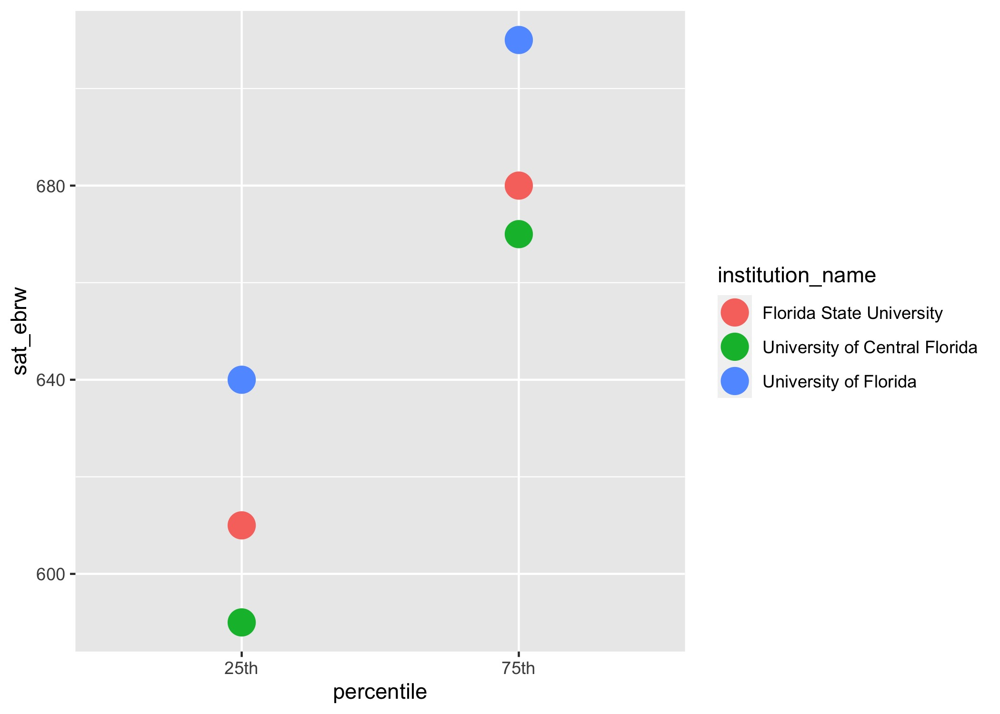

# Introducing the Pipe

- First, let's review what each of the five `dplyr` verbs does:
    - `select()`
    - `arrange()`
    - `filter()`
    - `mutate()`
    - `summarize()`
- What is the first argument of each?
- When this happens, we can use the `%>%` (pipe) operator.
    
## Code Together: Load Packages
    
```{r setup, include = FALSE}
knitr::opts_chunk$set(echo = TRUE, message = FALSE, warning = FALSE)

library(tidyverse)
library(vized)
library(knitr)

```
    
## Code Together: Pipe Syntax

- At the end of last section, we wanted to do the following:
    1. Use `mutate()` to create a new column that computes the mean of `sat_ebrw` and `sat_math`.
    2. Use `arrange()` to sort the data from highest to lowest mean SAT.
    3. Use `select()` to choose only `institution_name`, `percentile`, and newly calculated column.

- Let's see how that would like with the %>%.
- The pipe can be typed out manually, or, with shortcuts:
    - Mac: Cmd+Shift+M
    - Windows / Linx: Ctrl+Shift+M
    
```{r}


```

- Think of the `%>%` as meaning "next do this...".
- We could continue as much as we'd like, for example, by then filtering for only 25th percentile scores.   

## Your Turn: Pipe Syntax
    
Now I'd like you to *use the pipe* on `ipeds_sat` to:

1. Use `filter()` to limit only rows that are equal to "75th" for percentile.
2. Continue the pipe to use `select()` to include only the columns `institution_name` and `sat_math`.

Hint: The first line should be `ipeds_sat` and your code should contain two `%>%`.

```{r}

```


## Code Together: Combining Pipe With Plots

- Pipes can be combined with plots.
- Here, let's filter for 25th percentile, and pipe the result to a scatterplot with `sat_math` on the x-axis and `sat_ebrw` on the y-axis.

```{r}


```

- Why can't I replace `+` with `%>%`? Isn't that confusing? Yes!

## Your Turn: Combining Pipe With Plots

- Now I'd like you to use the pipe operator on `ipeds_sat` to create the following scatterplot with `geom_point()`:

1. Use `filter()` to choose any three institutions you'd like.
2. With the resulting data, create a plot with `percentile` on the x-axis, `sat_ebrw` on the y-axis, and the color of the points representing `institution_name`.

Hint: Remember, in filter use the `|` symbol to make multiple selections: For example:

`filter(institution_name == "school A" | institution_name == "school B")`

The result should look similar to the plot below:

```{r}


  
```

```{r}

```

- Save time with `%in%`.

## Your Turn: Navigate to next section

- Navigate to 05-group-by.Rmd