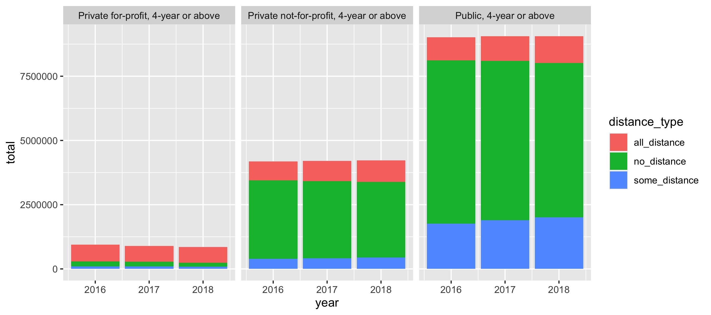

# Other Chart Types

- Remember the  formula for creating charts.

```{r template_1, eval = FALSE, echo = TRUE}

ggplot(data = <DATA>) + 
  <GEOM_FUNCTION>(mapping = aes(<MAPPINGS>))

```

- Ultimately, once you learn this formula, you can make any chart.
- Unlike scatterplots, here we'll transform data before plotting it.

## Code Together: Load Packages & Line Charts


```{r setup, include = FALSE}
knitr::opts_chunk$set(echo = TRUE, warning = FALSE, message = FALSE)

library(tidyverse)
library(vized)
library(scales)
library(knitr)
library(ggthemes)

```

- Continuuing with the `ipeds_distance` dataset, let's create a summary of the data before plotting a line chart.
- Use `group_by()` and `summarize()` to find total headcount by `year` and `distance_type`.
- Now let's pipe that to a line chart with `year` on the x-axis, our new total column on the y-axis, and have the color of the line be represented by `distance_type`.

```{r}

```

## Your Turn: Combining geoms to Add Points

- In the space below, take the chart we just created, use `geom_point()` to add points to the lines that represent each year. Hint: You will be using multiple geoms.

```{r}

```

## Your Turn: Bar Charts

- The geom for bar charts is `geom_col()`.
- In the space below is the code for the chart we just created.
- I'd like you to update the chart we just created by removing the `geom_point()` and replacing `geom_line()` with `geom_col()`. 
- Does something look wrong? 
- Bonus, figure out how to fill in the bars rather than the borders. You might:
    - Use a search engine to find the answer. Results from StackOverflow are a good place to start.
    - Using the geom_col help page by running the code `?geom_col()`. Hint: Scroll down to the aesthetics section of the help page.
    
    
```{r}
ipeds_distance %>% 
  group_by(year, distance_type) %>% 
  summarize(total = sum(headcount)) %>% 
  ungroup() %>% 
  ggplot(aes(x = year, y = total, color = distance_type)) +
  geom_line() +
  geom_point()
```

## Your Turn: Faceted Bar Chart

- First, run code below to show chart.

```{r}


  
```

- Now, I'd like you to fill in the blanks below to replicate the chart above. Make sure to completely remove all of the underscores.
- Tip: If you are stuck, you might find it help to run lines of code as you complete them.
- Any guesses as to what ` filter(str_detect(sector_description, "4-year"))` does?


```{r, eval = FALSE}

ipeds_distance %>% 
  filter(str_detect(sector_description, "4-year")) %>% 
  group_by(year, _________ , distance_type) %>% 
  summarize(total = sum(headcount)) %>% 
  ungroup() %>% 
  ggplot(aes(x = year, y = total, fill = ________)) +
  geom_col() +
  facet_wrap(~ ________)
```


## Extending Principles of ggplot2

### Heat Maps

```{r}

ipeds_distance %>% 
  filter(str_detect(sector_description, "4-year"), year == 2018) %>% 
  count(level, sector_description, distance_type) %>% 
  group_by(level, sector_description) %>% 
  mutate(total = sum(n)) %>% 
  ungroup() %>% 
  mutate(prop = n / total,
         distance_type = str_replace(distance_type, "_", " "),
         distance_type = str_to_title(distance_type),
         level = str_to_title(level),
         level = fct_relevel(level, "Undergraduate")) %>% 
  filter(distance_type != "No Distance") %>% 
  ggplot(aes(x = distance_type, y = sector_description, fill = prop)) +
  geom_tile() +
  scale_fill_continuous(label = percent_format(accuracy = 1)) +
  labs(x = NULL, y = NULL, fill = "% of Students",
       title = "Distance Education Status by Sector",
       subtitle = "Fall 2018 Undergraduate & Graduate Enrollment",
       caption = "Source: IPEDS Data Center") +
  facet_wrap(~ level) +
  theme_minimal() 

```

### Chloropleths

```{r}
us_states <- map_data("state")

prop_all_distance <- ipeds_distance %>% 
  inner_join(ipeds_coordinates %>% select(unit_id, region = state_description)) %>% 
  filter(year == 2018) %>% 
  group_by(region, distance_type) %>% 
  summarize(by_distance = sum(headcount)) %>% 
  group_by(region) %>% 
  mutate(total = sum(by_distance),
         prop = by_distance / total) %>% 
  ungroup() %>% 
  filter(distance_type == "all_distance") %>% 
  mutate(region = tolower(region))

us_states <- inner_join(us_states, prop_all_distance)

us_states %>% 
  ggplot(aes(x = long, y = lat, group = group, fill =  prop)) +
  geom_polygon() +
  scale_fill_gradient(label = percent_format()) +
  labs(fill = "% Distance", 
       title = "Percent of 'All Distance' Students",
       subtitle = "Fall 2018 Enrollment",
       caption = "Source: IPEDS Data Center") +
  theme_map()


```

## Conclusion

- These prinicples can be used to build any type of chart. Always remember:

```{r template_2, eval = FALSE, echo = TRUE}

ggplot(data = <DATA>) + 
  <GEOM_FUNCTION>(mapping = aes(<MAPPINGS>))

```

- You may have noticed some of these charts were spruced up.

## Your Turn: Navigate to Next Section

- Navigate to 08-spruce-charts.Rmd
